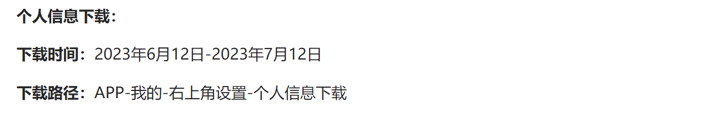
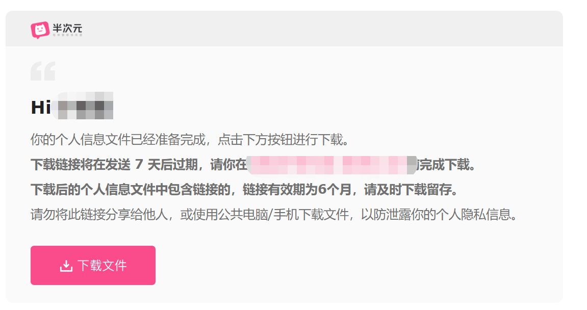
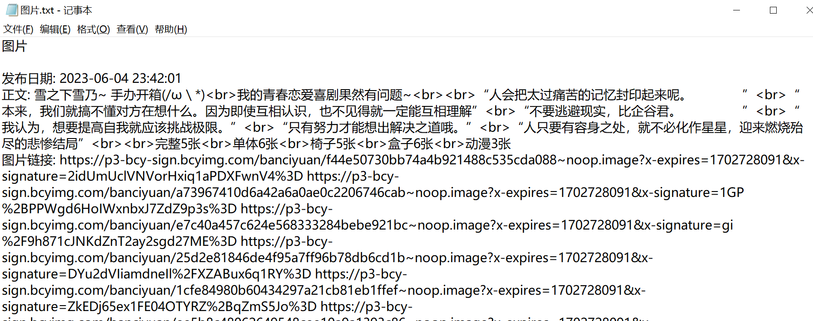
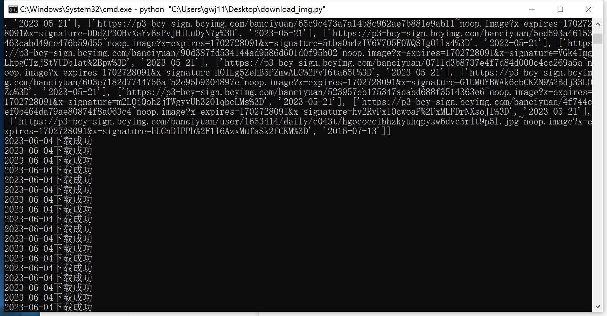
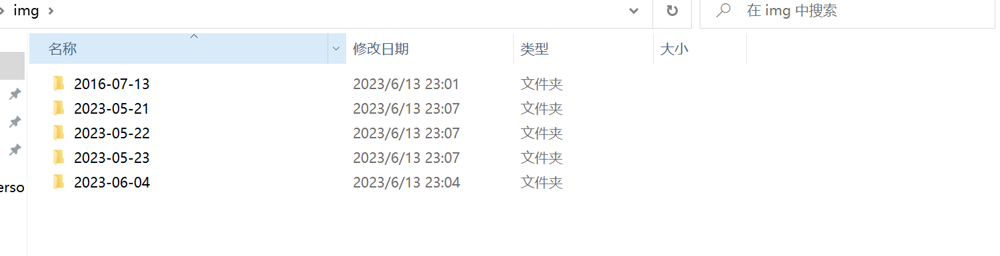
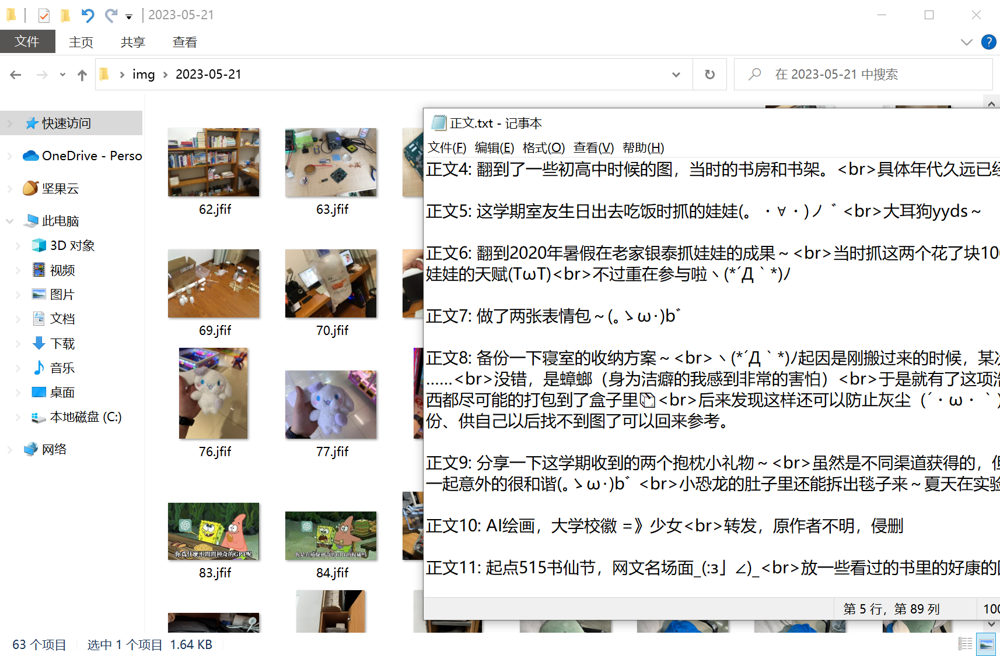

## bcy-spider

> 半次元个人图片信息，一键下载存档， 2023.06.13

#### 1、项目背景

**2023-06-13 [半次元](https://bcy.net/)宣布下架**

+ 停服公告：[地址](https://bcy.net/item/detail/7243752692219124791)

+ **官方给了个人数据下载**：

  

+ 然而我获得的数据是这样的？？？

  还被告知6个月后图片过期无法下载。

  

+ 作为7年老用户，就算是个小透明没发过多少东西。
  
  几十上百张的图（包括仅自己可见的）还是有的，总不能让我一张一张的下。。。

#### 2、关于本项目

> 临时1-2小时造出来的，仅供自己存档留念，数据搞下来了就行，估计也不太会翻看，所以也没写的很仔细。
>
> 如果有小伙伴需要的话，可以自己加一些功能，欢迎提交pull request（最近期末可能消息看的不一定很及时）。

项目简介

+ 支持爬虫一键下载个人的图片信息，并按日期分类整理到文件夹
+ 当天文件夹：图片按全局顺序编号存入，然后有一个正文.txt，正文xxx的形式，存放当天所有动态的正文。

**本地环境**

原生：[python](https://www.python.org/downloads/) >= 3.8

依赖：`python -m pip install retrying -i http://pypi.douban.com/simple --trusted-host pypi.douban.com`

